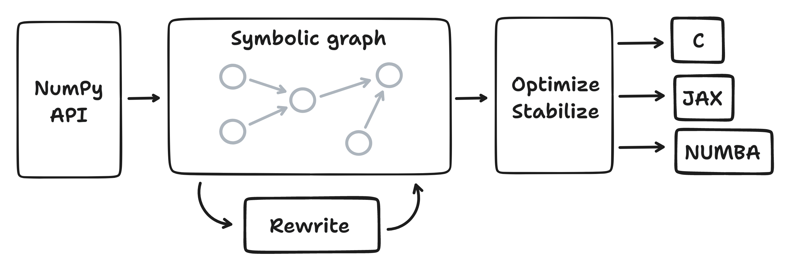

<div align="center">

</img>

[![Pypi][pypi-badge]][pypi]
[![Downloads][downloads-badge]][releases]
[![Contributors][contributors-badge]][contributors]
 </br>
[![Gitter][gitter-badge]][gitter]
[![Discord][discord-badge]][discord]
[![Twitter][twitter-badge]][twitter]

Aesara is a Python library that allows one to define, optimize, and
efficiently evaluate mathematical expressions involving multi-dimensional
arrays.

*A fast and hackable meta-tensor library in Python*

[Features](#features) •
[Get Started](#get-started) •
[Install](#install) •
[Get help](#get-help) •
[Contribute](#contribute)

[Roadmap](https://github.com/orgs/aesara-devs/projects/3) •
[Docs](https://aesara.readthedocs.io/en/latest/)

</div>

## Features

- A hackable, pure-Python codebase
- Extensible graph framework suitable for rapid development of custom operators and symbolic optimizations
- Implements an extensible graph transpilation framework that currently provides
  compilation via C, [JAX](https://github.com/google/jax), and [Numba](https://github.com/numba/numba).
- Based on one of the most widely-used Python tensor libraries: [Theano](https://github.com/Theano/Theano).

Symbolic Graph<->Rewrites->Optimize/Stabilize->[C, Jax, Numba]"></img>

## Get started

``` python
import aesara
from aesara import tensor as at

# Declare two symbolic floating-point scalars
a = at.dscalar("a")
b = at.dscalar("b")

# Create a simple example expression
c = a + b

# Convert the expression into a callable object that takes `(a, b)`
# values as input and computes the value of `c`.
f_c = aesara.function([a, b], c)

assert f_c(1.5, 2.5) == 4.0

# Compute the gradient of the example expression with respect to `a`
dc = aesara.grad(c, a)

f_dc = aesara.function([a, b], dc)

assert f_dc(1.5, 2.5) == 1.0

# Compiling functions with `aesara.function` also optimizes
# expression graphs by removing unnecessary operations and
# replacing computations with more efficient ones.

v = at.vector("v")
M = at.matrix("M")

d = a/a + (M + a).dot(v)

aesara.dprint(d)
# Elemwise{add,no_inplace} [id A] ''
#  |InplaceDimShuffle{x} [id B] ''
#  | |Elemwise{true_divide,no_inplace} [id C] ''
#  |   |a [id D]
#  |   |a [id D]
#  |dot [id E] ''
#    |Elemwise{add,no_inplace} [id F] ''
#    | |M [id G]
#    | |InplaceDimShuffle{x,x} [id H] ''
#    |   |a [id D]
#    |v [id I]

f_d = aesara.function([a, v, M], d)

# `a/a` -> `1` and the dot product is replaced with a BLAS function
# (i.e. CGemv)
aesara.dprint(f_d)
# Elemwise{Add}[(0, 1)] [id A] ''   5
#  |TensorConstant{(1,) of 1.0} [id B]
#  |CGemv{inplace} [id C] ''   4
#    |AllocEmpty{dtype='float64'} [id D] ''   3
#    | |Shape_i{0} [id E] ''   2
#    |   |M [id F]
#    |TensorConstant{1.0} [id G]
#    |Elemwise{add,no_inplace} [id H] ''   1
#    | |M [id F]
#    | |InplaceDimShuffle{x,x} [id I] ''   0
#    |   |a [id J]
#    |v [id K]
#    |TensorConstant{0.0} [id L]

```

See [the Aesara documentation][documentation] for in-depth tutorials.

## Install

The latest release of Aesara can be installed from PyPI using ``pip``:

``` python
pip install aesara
```

Or via conda-forge:

``` python
conda install -c conda-forge aesara
```


The current development branch of Aesara can be installed from GitHub, also using ``pip``:

``` python
pip install git+https://github.com/aesara-devs/aesara
```


## Get help

Report bugs by opening an [issue][issues]. If you have a question regarding the usage of Aesara, start a [discussion][discussions]. For real-time feedback or more general chat about Aesara use our [Discord server][discord], or [Gitter][gitter].

## Contribute

We welcome bug reports and fixes and improvements to the documentation.

For more information on contributing, please see the
[contributing guide](https://github.com/aesara-devs/aesara/blob/main/.github/CONTRIBUTING.md)
and the Aesara [Mission Statement](https://github.com/aesara-devs/aesara/blob/main/doc/mission.rst).

A good place to start contributing is by looking through [the issues][issues].

## Support

Special thanks to [Bram Timmer](http://beside.ca) for the logo.

[contributors]: https://github.com/aesara-devs/aesara/graphs/contributors
[contributors-badge]: https://img.shields.io/github/contributors/aesara-devs/aesara?style=flat-square&logo=github&logoColor=white&color=ECEFF4
[discussions]: https://github.com/aesara-devs/aesara/discussions
[documentation]: https://aesara.readthedocs.io/en/latest
[downloads-badge]: https://img.shields.io/pypi/dm/aesara?style=flat-square&logo=pypi&logoColor=white&color=8FBCBB
[discord]: https://discord.gg/h3sjmPYuGJ
[discord-badge]: https://img.shields.io/discord/1072170173785723041?color=81A1C1&logo=discord&logoColor=white&style=flat-square
[gitter]: https://gitter.im/aesara-devs/aesara
[gitter-badge]: https://img.shields.io/gitter/room/aesara-devs/aesara?color=81A1C1&logo=matrix&logoColor=white&style=flat-square
[issues]: https://github.com/aesara-devs/aesara/issues
[releases]: https://github.com/aesara-devs/aesara/releases
[twitter]: https://twitter.com/AesaraDevs
[twitter-badge]: https://img.shields.io/twitter/follow/AesaraDevs?style=social
[pypi]: https://pypi.org/project/aesara/
[pypi-badge]: https://img.shields.io/pypi/v/aesara?color=ECEFF4&logo=python&logoColor=white&style=flat-square
