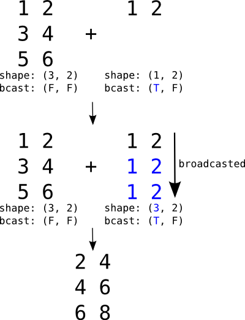

.. _reference_shapes:

Shapes
======

How Shape Information is Handled by Aesara
------------------------------------------

Currently, information regarding shape is used in the following ways by Aesara:

- To remove computations in the graph when we only want to know the
  shape, but not the actual value of a variable. This is done with the
  :meth:`Op.infer_shape` method.

- To generate faster compiled code (e.g. for a 2D convolution).

Example:

>>> import aesara
>>> x = aesara.tensor.matrix('x')
>>> f = aesara.function([x], (x ** 2).shape)
>>> aesara.dprint(f)
MakeVector{dtype='int64'} [id A] ''   2
 |Shape_i{0} [id B] ''   1
 | |x [id C]
 |Shape_i{1} [id D] ''   0
   |x [id C]

The output of this compiled function does not contain any multiplication or
power computations; Aesara has removed them to compute the shape of the output
directly.

Aesara propagates information about shapes within a graph using specialized
:class:`Op`\s and static :class:`Type` information (see :ref:`aesara_type`).

Specifying Exact Shape
----------------------

You can create variables with static shape information as follows:

.. code-block:: python

    aesara.tensor.tensor("float64", shape=(4, 3, 2))

You can also pass shape infomation directly to some :class:`Op`\s, like ``RandomVariables``

.. code-block:: python

    aesara.tensor.random.normal(size=(7, 3, 5, 5))

- You can use the :class:`SpecifyShape`\ :class:`Op` to add shape information anywhere in the
  graph. This allows to perform some optimizations. In the following example,
  this makes it possible to precompute the Aesara function to a constant.

>>> import aesara
>>> x = aesara.tensor.matrix()
>>> x_specify_shape = aesara.tensor.specify_shape(x, (2, 2))
>>> f = aesara.function([x], (x_specify_shape ** 2).shape)
>>> aesara.printing.debugprint(f) # doctest: +NORMALIZE_WHITESPACE
DeepCopyOp [id A] ''   0
 |TensorConstant{(2,) of 2} [id B]

Problems with Shape inference
-----------------------------

Sometimes this can lead to errors.  Consider this example:

>>> import numpy as np
>>> import aesara
>>> x = aesara.tensor.matrix('x')
>>> y = aesara.tensor.matrix('y')
>>> z = aesara.tensor.join(0, x, y)
>>> xv = np.random.random((5, 4))
>>> yv = np.random.random((3, 3))

>>> f = aesara.function([x, y], z.shape)
>>> aesara.printing.debugprint(f) # doctest: +NORMALIZE_WHITESPACE
MakeVector{dtype='int64'} [id A] ''   4
 |Elemwise{Add}[(0, 0)] [id B] ''   3
 | |Shape_i{0} [id C] ''   2
 | | |x [id D]
 | |Shape_i{0} [id E] ''   1
 |   |y [id F]
 |Shape_i{1} [id G] ''   0
   |x [id D]

>>> f(xv, yv) # DOES NOT RAISE AN ERROR AS SHOULD BE.
array([8, 4])

>>> f = aesara.function([x,y], z)# Do not take the shape.
>>> aesara.printing.debugprint(f) # doctest: +NORMALIZE_WHITESPACE
Join [id A] ''   0
 |TensorConstant{0} [id B]
 |x [id C]
 |y [id D]

>>> f(xv, yv)  # doctest: +ELLIPSIS
Traceback (most recent call last):
  ...
ValueError: ...

As you can see, when asking only for the shape of some computation (``join`` in the
example above), an inferred shape is computed directly, without executing
the computation itself (there is no ``join`` in the first output or debugprint).

This makes the computation of the shape faster, but it can also hide errors. In
this example, the computation of the shape of the output of ``join`` is done only
based on the first input Aesara variable, which leads to an error.

This might happen with other `Op`\s such as :class:`Elemwise` and :class:`Dot`, for example.
Indeed, to perform some optimizations/rewrites (for speed or stability, for instance),
Aesara assumes that the computation is correct and consistent
in the first place, as it does here.

You can detect those problems by running the code without this optimization,
using the Aesara flag ``optimizer_excluding=local_shape_to_shape_i``. You can
also obtain the same effect by running in the modes ``FAST_COMPILE`` or
:class:`DebugMode`.

Broadcasting
------------

Broadcasting is a mechanism which allows tensors with
different numbers of dimensions to be added or multiplied
together by (virtually) replicating the smaller tensor along
the dimensions that it is lacking.

Broadcasting is the mechanism by which a scalar
may be added to a matrix, a vector to a matrix or a scalar to
a vector.

Broadcasting a row matrix. T and F respectively stand for
True and False and indicate along which dimensions we allow
broadcasting.

If the second argument were a vector, its shape would be
``(2,)`` and its broadcastable pattern ``(False,)``. They would
be automatically expanded to the **left** to match the
dimensions of the matrix (adding ``1`` to the shape and ``True``
to the pattern), resulting in ``(1, 2)`` and ``(True, False)``.
It would then behave just like the example above.

Unlike numpy which does broadcasting dynamically, Aesara needs
to know, for any operation which supports broadcasting, which
dimensions will need to be broadcasted. When applicable, this
information is given in the :ref:`type` of a *Variable*.

The following code illustrates how rows and columns are broadcasted in order to perform an addition operation with a matrix:

>>> r = at.row()
>>> r.broadcastable
(True, False)
>>> mtr = at.matrix()
>>> mtr.broadcastable
(False, False)
>>> f_row = aesara.function([r, mtr], [r + mtr])
>>> R = np.arange(3).reshape(1, 3)
>>> R
array([[0, 1, 2]])
>>> M = np.arange(9).reshape(3, 3)
>>> M
array([[0, 1, 2],
       [3, 4, 5],
       [6, 7, 8]])
>>> f_row(R, M)
[array([[  0.,   2.,   4.],
       [  3.,   5.,   7.],
       [  6.,   8.,  10.]])]
>>> c = at.col()
>>> c.broadcastable
(False, True)
>>> f_col = aesara.function([c, mtr], [c + mtr])
>>> C = np.arange(3).reshape(3, 1)
>>> C
array([[0],
       [1],
       [2]])
>>> M = np.arange(9).reshape(3, 3)
>>> f_col(C, M)
[array([[  0.,   1.,   2.],
       [  4.,   5.,   6.],
       [  8.,   9.,  10.]])]

In these examples, we can see that both the row vector and the column vector are broadcasted in order to be be added to the matrix.

See the `Numpy documentation <https://numpy.org/doc/stable/user/basics.broadcasting.html>`_ for an in-depth explanation of the broadcasting mechanism.
